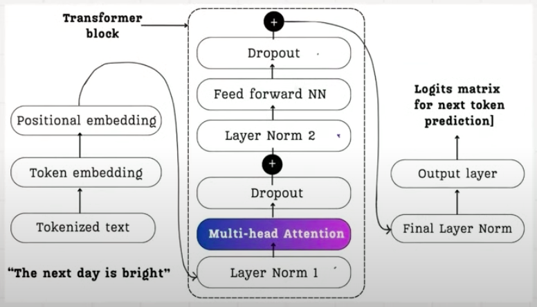

# InsideLLM-Transformers
How do LLMs work internally?  
The transformers are at the heart of an LLM architecture. The fig below shows a model Tranformer architecture.
Each token in the input query - "The next day is bright" goes through these transformer layers to predict the next token, say "and".

It starts with tokenising the input & creating a vector representation of each token. This vector representation is a long numeric interpretation often referred as embedding. In addition to the vector representation, we also need the positional information of each token in the input query. This is important because word order is critical for understanding language - "dog bites man" means something very different from "man bites dog". This is where the positional embedding comes into picture. **Positional Emdedding** allows transformers to understand the order of tokens in language. Once we have both these vectors, they are passed through the transformer block and starts with Multi Head Attention (MHA)

To understand MHA, we need to first understand *Self Attention*.

This repo contains the fundamentals of LLM transformers starting from Self Attention & then gradually progressing to MHA and Causal Attention.

## Self Attention
Self-attention is a fundamental mechanism in modern language models that allows each token in a sequence to attend to (or "focus on") all other tokens in the same sequence. Here's how it works:

### Basic Self-Attention
1) Query, Key, Value Projections:
For each token in the input sequence, we create three vectors:

* Query (Q): Represents what the token is "looking for"
* Key (K): Represents what the token "contains" or "offers"
* Value (V): Contains the actual information to be aggregated  

2) Attention Score Calculation:
For each position, we calculate how much focus (i.e attention) to put on each other position.
This is done via **dot product** between the Query of the current token and Keys of all tokens. Dot product is one of the means to calculate similarity between 2 tokens. Scores are scaled by dividing by √d (where d is embedding dimension) to prevent exploding gradients

3) Softmax & Weighting:
Scores are passed through softmax to get weights between 0 and 1 that sum to 1. This is done so that it becomes easier to understand the percentage contribution of each token to attention. These weights are applied to the Value vectors. The weighted sum becomes the output for the current position

[Implementation-Self Attention](SelfAttention.ipynb)

## Causal Attention
Causal self-attention (used in decoder-only models like GPT) adds an important constraint:
* Each position can only attend to itself and previous positions
* This is implemented using a triangular mask that sets attention scores for future positions to -infinity
* This ensures the model doesn't "cheat" by looking at future tokens when predicting the next token

### Key Implementation Details
* Linear Projections: Three separate linear transformations to create Q, K, and V from the same input
  
* Scaled Dot-Product:
  * Using torch.bmm (batch matrix multiplication) to efficiently compute attention scores
  * Scaling by 1/√embedding_dim to stabilize gradients
    
* Masking:
    * Optional general mask for padding tokens in the regular self-attention
    * Causal mask (lower triangular) in the causal self-attention

* Dropout:
Applied to attention weights for regularization

The final result of Causal Attention is always a traingular zero that appears above the left diagonal in the output matrix.

[Implementation-Causal Attention](CausalAttention.ipynb)

## Multi Head Attention
Multi-head attention is an enhancement to the standard attention mechanism that allows the model to jointly attend to information from different representation subspaces at different positions. Rather than performing a single attention function with queries, keys, and values, multi-head attention:

* Splits the embedding dimension into multiple smaller parts (heads)
* Performs attention independently on each part
* Concatenates the results
* Projects back to the original dimension

### Why Multiple Heads?
Multiple attention heads allow the model to:
* Focus on different aspects simultaneously: Each head can specialize in different types of relationships (e.g., syntactic relationships, semantic similarities, or long-distance dependencies)
* Capture different context patterns: Some heads might focus on local context while others capture long-range dependencies

E.g. Consider this sentence - "The painter paints a womon with a brush". This sentence has 2 meeanings. With MHA, we aim to capture both the meanings via 'heads'.

## Key Value cache
Coming Soon...

## Grouped Query Attention
Coming Soon...

## Multi Head Latent Attention
Coming Soon...
